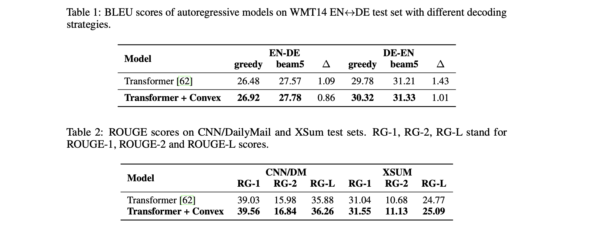
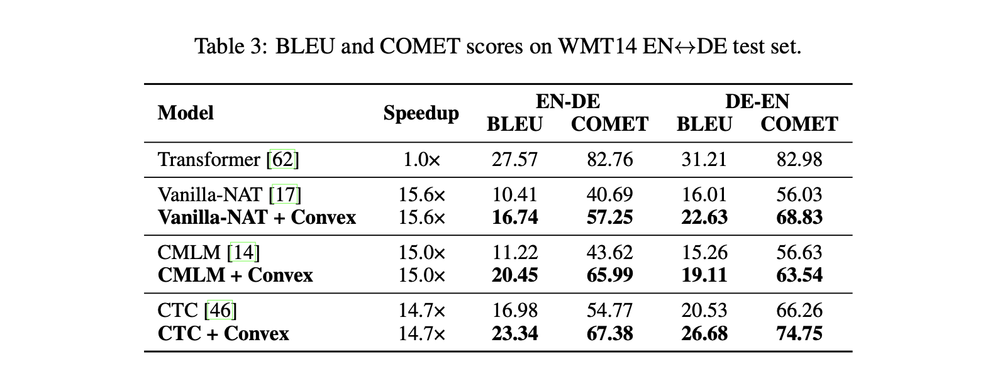
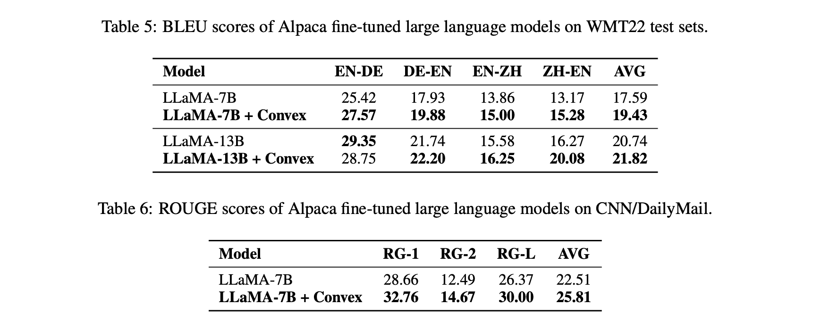

# Convex Learning

This repository contains the implementation for the NeurIPS 2023 paper "**[``Beyond MLE: Convex Learning for Text Generation``](https://openreview.net/forum?id=sla7V80uWA)**". 

**Abstract**: We introduce convex learning, a novel class of training objectives with desirable theoretical properties that enable text generation models to focus on highly probable outputs without having to estimate the entire data distribution. Convex learning bridges the gap between greedy and beam search for autoregressive models, facilitates the learning of non-autoregressive models, and also enhances the generative capability of large language models.

<details>
  <summary>Click Here for Performance on autoregressive models</summary>

  
</details>


<details>
  <summary>Click Here for Performance on non-autoregressive models</summary>

  
</details>

<details>
  <summary>Click Here for Performance on large language models</summary>

  
</details>

Follow the instructions below to reproduce results on autoregressive and non-autoregressive models. Follow this [guideline](./LLM/README.md) to reproduce results on large language models.

## Requirements & Installation

### Requirements

* Python >= 3.7
* Pytorch == 1.10.1 (tested with cuda == 11.3)

### Installation
```bash
git clone --recurse-submodules https://github.com/ictnlp/Convex-Learning.git
cd Convex-Learning && cd fairseq
pip install --editable ./
python setup.py build develop
```
## Data Preparation
Download the preprocessed [WMT14 En-De](http://dl.fbaipublicfiles.com/nat/original_dataset.zip) dataset and generate the binarized data required for fairseq training:
```bash
cd Convex-Learning
wget http://dl.fbaipublicfiles.com/nat/original_dataset.zip
unzip original_dataset.zip
input_dir=./wmt14_ende        # directory of pre-processed text data
data_dir=./wmt14_ende_bin   # directory of the generated binarized data

fairseq-preprocess --source-lang en --target-lang de \
    --trainpref ${input_dir}/train.en-de \
    --validpref ${input_dir}/valid.en-de \
    --testpref ${input_dir}/test.en-de \
    --destdir ${data_dir} --workers 32 --joined-dictionary

```

## Training

The training process includes two stages: pre-training with MLE and fine-tuning with convex-composition loss. We provide all the training scripts at [train_scripts](./train_scripts). For example, the following commands pre-train Vanilla-NAT with MLE and fine-tune it with convex-composition loss:

```bash
# pre-train Vanilla-NAT with MLE
CUDA_VISIBLE_DEVICES=0,1,2,3 sh train_scripts/train_vanilla.sh
# fine-tune Vanilla-NAT with convex-composition loss
CUDA_VISIBLE_DEVICES=0,1,2,3 sh train_scripts/train_vanilla_convex.sh
```

Adjust the `CUDA_VISIBLE_DEVICES` depending on the number of your available GPUs. Additionally, modify the `--update-freq` in training scripts to maintain a consistent batch size. For example, if you have 8 GPUs, you should decrease --update-freq by 50%.

## Decoding & Evaluation
Autoregressive models typically use beam search to generate outputs, where greedy search corresponds to the setting of `--beam 1`. Non-autoregressive models can directly apply argmax decoding at each step to generate outputs. The performance on machine translation can be evaluated with the script [multi-bleu.perl](./test_scripts/multi-bleu.perl), which provides the tokenized BLEU score. We provide all the decoding scripts at [test_scripts](./test_scripts). For example, the following command generates the outputs of Vanilla-NAT+Convex and evaluates the tokenized BLEU score:

```bash
sh test_scripts/test_vanilla.sh
```

## Citation

If this repository is useful for you, please cite as:

```
@inproceedings{shao-etal-2023-convex,
    title={Beyond MLE: Convex Learning for Text Generation},
    author={Shao, Chenze* and Ma, Zhengrui* and Zhang, Min and Feng, Yang},
    booktitle={Advances in Neural Information Processing Systems},
    year={2023},
}
```
